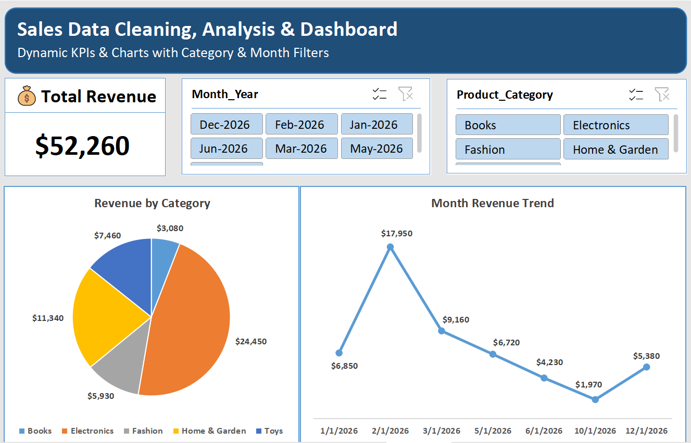

# Sales Data Cleaning, Analysis & Dashboard: Uncovering Revenue Concentration and a Post-Peak Drop-off in Excel
  
---
 
## Executive Summary
 
### 🎯 Business Question
 
*(Simulated scenario — the dataset is synthetic, generated for portfolio purposes, but the project is framed the way a real stakeholder request would be.)*
 
A business wants to understand its sales performance — which product categories drive the most revenue, how revenue trends over time, and whether growth is broad-based or concentrated in a few areas. Before any of that can be answered, the raw sales data needs to be cleaned and organized.
 
### ⚖️ Trade-offs & Assumptions
 
- The dataset was generated using AI for portfolio purposes. All data is synthetic and does not represent real individuals.
- Due to privacy considerations, the complete Excel dataset is not publicly shared. Selected sample screenshots from raw dataset are provided to demonstrate the cleaning and analysis workflow.
- The raw dataset has 95 rows (including header), with duplicates present; a single duplicate row was removed.
- The `Sales_Date` column was already converted to MDY format by Text to Columns, so dates in the wrong DMY format were corrected to match.
- Email domain errors were corrected by appending ".com" where missing, and special characters were cleaned by replacing "_" with "." and standardizing to lowercase.
- Null values in the email column were replaced with "No Email Provided".

### 📌 Key Insights
 
| Question | Result |
|---|---|
| Revenue by Category — which categories drive the most revenue? | _Electronics and Home & Garden together drive 68.48% of total revenue_ |
| Monthly Revenue Trends — how does revenue change over time? | _Revenue peaked in February and was lowest in December_ |
 
1. **High Revenue Concentration Risk** — The Electronics category dominates nearly half of total revenue (_46.79 %_), creating heavy reliance on a single product line. Any market shift affecting that category would impact the entire business's financial health.
2. **Post-Peak Retention Collapse** — Revenue peaks in Month 2, then drops steadily over the following four months. This suggests the business can attract customers initially but struggles to retain repeat purchases.

### 💡 Recommendations
 
1. **Diversify revenue away from Electronics** — since one category accounts for close to half of total revenue, consider actively growing other categories to reduce single-category dependency risk.
2. **Investigate the post-Month-2 drop-off** — look into what changes after the peak (pricing, promotions ending, seasonality, inventory) to understand why customers aren't returning.
 
## 📊 Dashboard
 
**Dashboard Screenshot:**
 

 
---
 
## 🛠️ Methodology
  
 
### Full Data Analytics Pipeline
 
#### Step 1: Bringing Data
 
Imported raw dataset (comma-separated in a single column) into Excel for processing
The raw dataset contained several inconsistencies including:
- Data was in a single column
- Inconsistent date formats & incorrect data type
- Casing inconsistencies in product category
- Leading spaces and special character issues, missing email domains and null values in Customer_Email Column
- Revenue column stored in incorrect format
**View Screenshot:**
 
[Raw Data (rows 1–25)](Data/Raw/screenshot/messy_raw_data.png)
 
---
 
#### Step 2: Data Cleaning and Formatting
 
The following cleaning steps are performed to clean the above raw data set to ensure data accuracy and consistency.
 
##### Text to Columns
Split data into columns using delimiter comma and the data type of Sales_Date converted to MDY format by TEXT TO COLUMNS
 
**View Screenshot:**
 
- [Text to Columns](Cleaning/screenshots/text_to_Column.png)
- [Organized Raw Data](Cleaning/screenshots/organized_raw_data.png)
---
 
##### Adjusting Column Width for Better Readability
Adjusted column widths to ensure all data is clearly visible and properly aligned for improved readability.
 
**View Screenshot:**
 
[Column Width Fix](Cleaning/screenshots/Column_widthh_issue.png)
 
---
 
##### Duplicate Removal
Removed a single duplicate row using Excel's "Remove Duplicates" feature from the ribbon to ensure unique records in the dataset.
 
**View Screenshot:**
 
[Duplicate Removal](Cleaning/screenshots/duplicate.png)
 
---
 
##### Sales_Date Cleaning and Formatting
Standardized date format by correcting wrong format DMY of some dates as the Sales_Date Column was already Converted to MDY format by TEXT TO COLUMNS
 
**View Screenshot:**
 
- [Date Cleaning — before](Cleaning/screenshots/invalid_Date_1.png)
- [Date Cleaning — after](Cleaning/screenshots/invalid_date_2.png)
---
 
##### Fixing Casing Issue in Product_Category
Fixed casing in Product_Category Column using
 
**Formula:**
```excel
= PROPER(B2)
```
 
**View Screenshot:**
 
[Fixed_Casing](Cleaning/screenshots/proper.png)
 
---
 
##### Email Column Cleaning and Standardization
 
**Handling Domain Errors**
Cleaned the email column by correcting domain formatting issues
 
**Formula:**
```excel
= IF(OR(C2="",C2="NULL",ISBLANK(C2)),C2,IF(RIGHT(C2,4)=".com",C2,C2&".com"))
```
 
**View Screenshot:**
 
[Handling_Domain_Errors](Cleaning/screenshots/missing.com.png)
 
---
 
**Special Character Cleanup & Case Standardization**
Cleaned special character issues and standardized lowercase formatting in the email column using LOWER() + SUBSTITUTE() to ensure consistency.
 
**Formula:**
```excel
= LOWER(SUBSTITUTE(C2,"_","."))
```
 
**View Screenshot:**
 
[Handling_special_character_and_Case](Cleaning/screenshots/Lower+Substitute.png)
 
---
 
**Removing Extra Spaces**
The Email column contained extra leading space in an email which is cleared using TRIM()
 
**View Screenshot:**
 
[Removing-Extra-Spaces](Cleaning/screenshots/trim.png)
 
---
 
**null Value Handling**
Replaced null values with "No Email Provided" using IF()
 
**View Screenshot:**
 
[Replacing_null](Cleaning/screenshots/null_email.png)
 
---
 
**Clean Data (rows 1–25):**
 
**View Screenshot:**
 
[Cleaned Data](Data/Clean/screenshot/final_clean.png)
 
---
 
#### Step 3: Preparing Data For Analysis
 
**Dataset Enhancement by adding Month-Year and Month-Start Columns**
Enhanced the dataset by creating two additional columns: Month_Year and Month_Start to support time-based analysis and improve trend tracking.
 
**View Screenshot:**
 
- [Month_Year Column](Analysis/screenshot/additional_column_1.png)
- [Month_Start](Analysis/screenshot/additional_col_2.png)
---
 
#### Step 4–5: Analyzing and Visualizing with PivotTables & Pivot Charts
 
Built PivotTables and matching Pivot Charts to answer two core questions (results are in the Executive Summary above).
 
**View Screenshot**
 
[Analysis](Analysis/screenshot/pivot.png)
 
---
 
#### Step 6: Dashboard Creation
 
An Excel dashboard was created to summarize insights visually (see the Dashboard section above).
 
---
 
## 🧰 Tools Used
 
- Excel (formulas, PivotTables, GETPIVOTDATA)
- Charts, slicers, & interactive dashboard features

---

### Dataset Information
 
- **Source:** The dataset used in this project was generated using AI for portfolio purposes. All data is synthetic and does not represent real individuals.
- **Raw dataset:** 95 rows (including header), with duplicates present
- **Type:** Excel Data Analytics / Dashboard Project
**Privacy Notice:** Due to privacy considerations, the complete Excel dataset is not publicly shared. Selected sample screenshots from raw dataset is provided to demonstrate the cleaning and analysis workflow
 
---

 
## 📁 Project Structure
 
```text
Sales Data Cleaning & Analysis Project/
│
├── Raw/
│ └── screenshot/
│ └── messy_raw_data.png
│
├── Data/
│
├── Clean/
│ └── screenshot/
│ └── final_clean.png
│
├── Cleaning/
│ └── screenshots/
│ ├── Column_widthh_issue.png
│ ├── Lower+Substitute.png
│ ├── duplicate.png
│ ├── invalid_Date_1.png
│ ├── invalid_date_2.png
│ ├── missing.com.png
│ ├── null_email.png
│ ├── organized_raw_data.png
│ ├── proper.png
│ ├── text_to_Column.png
│ └── trim.png
│
├── Analysis/
│ └── screenshot/
│ ├── Untitled.png
│ ├── additional_col_2.png
│ ├── additional_column_1.png
│ └── pivot.png
│
├── Dashboard/
│ └── screenshot/
│ └── dashboard.png
│
└── README.md
```
 
---
 
## 👤 Author
 
Yasir Shah | Data Analyst | SQL | Power BI | Excel
 
- www.linkedin.com/in/yasir-shah-2364183b3
- https://github.com/yasirshah-analyst
- shahyasir443@gmail.com
